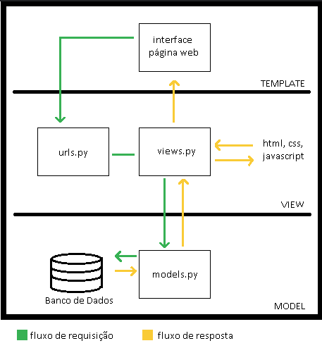

# 🚀 Vozes das Cores: Um Projeto de Saúde Mental com Django 🎉

### Templete Esboço.

Projeto de Desenvolvimento web - vozes das cores https://pedagogianapraca.my.canva.site/janeirobranco

### Descrição do Projeto
Este é um projeto de desenvolvimento web, inspirado no movimento **Janeiro Branco**, que tem como objetivo conscientizar sobre a importância da saúde mental. O site conta com um mural de mensagens onde os usuários podem deixar mensagens de apoio e suas experiências de forma positiva.

O projeto foi desenvolvido como um requisito para a disciplina de Desenvolvimento Web e utiliza o framework Django.

### Funcionalidades do Projeto

- ✅ **Mural de Mensagens**: Um espaço lindo e dinâmico onde as vozes dos usuários ganham vida.
- 💬 **Formulário Completo**: Um formulário fácil de usar para enviar nome, e-mail, telefone e, claro, a sua mensagem!
- 🎨 **Design Responsivo**: As mensagens aparecem em blocos de até 3 quadros, perfeitos para qualquer tela.
- 🔒 **Dados Seguros**: Seus dados de contato (e-mail e telefone) são guardados com carinho no banco de dados, mas não são exibidos publicamente.

### Tecnologias Utilizadas
- **Python** 🐍: O coração do projeto.
- **Django**: O framework mágico que fez tudo isso acontecer.
- **HTML/CSS**: Para o visual incrível e a experiência de navegação.
- **SQLite3**: Nosso banco de dados para guardar todas as mensagens especiais.
- **Git/GitHub**: Para o controle de versão e para você poder ver todo o código!

### **Acesse o Site Online! 🔗**

A melhor parte é que o site já está no ar! Você pode ver o resultado final clicando aqui:

[**https://Gborges19.pythonanywhere.com/**](https://Gborges19.pythonanywhere.com/)

### **Quer Rodar o Projeto Localmente?** 🏃‍♀️

Se quiser rodar o projeto na sua máquina e fazer suas próprias mudanças, siga estes passos:

1.  Clone o repositório:
    ```bash
    git clone [https://github.com/Gborges19/Vozes-das-Cores-Django.git](https://github.com/Gborges19/Vozes-das-Cores-Django.git)
    cd Vozes-das-Cores-Django
    ```

2.  Crie e ative um ambiente virtual:
    ```bash
    python -m venv venv
    # No Windows:
    venv\Scripts\activate
    # No macOS/Linux:
    source venv/bin/activate
    ```

3.  Instale todas as dependências:
    ```bash
    pip install -r requirements.txt
    ```

4.  Rode as migrações do banco de dados:
    ```bash
    python manage.py migrate
    ```

5.  Inicie o servidor de desenvolvimento:
    ```bash
    python manage.py runserver
    ```
    E pronto! O site estará no ar em `http://127.0.0.1:8000/`.

### Explicação do MVT

O projeto Django segue o padrão de arquitetura **MVT (Model-View-Template)**, que organiza o código da seguinte forma:

- **Model (Modelo):** Representado pelo arquivo `models.py`. O Model é responsável por gerenciar os dados do site, definindo a estrutura das informações que são armazenadas no banco de dados (SQLite). No caso, a classe `MensagemDeApoio` é o Model.

- **View (Visão):** Representado pelo arquivo `views.py`. A View contém a lógica de negócios da nossa aplicação. Ela recebe as requisições do usuário, interage com o Model para buscar ou salvar dados e, em seguida, decide qual Template deve ser renderizado para exibir a resposta. A função `home` é a principal View.

- **Template (Modelo de Apresentação):** Representado pelo arquivo `index.html`. O Template é a camada de apresentação, definindo a estrutura visual da página web e como os dados fornecidos pela View devem ser exibidos.

## Arquitetura MVT (Model-View-Template)

Aqui está um diagrama ilustrando o fluxo da arquitetura MVT no nosso projeto Django:



**Fluxo da Requisição e Resposta:**

Quando um usuário acessa a página inicial:

1.  O navegador envia uma **requisição** (indicada pelas setas verdes no diagrama).
2.  O Django (através do `urls.py`) direciona essa requisição para a **View** correspondente (`views.py`).
3.  A **View** pode interagir com o **Model** (`models.py`) para buscar os dados das mensagens do banco de dados.
4.  A **View** então seleciona o **Template** (`index.html`) e passa os dados para ele.
5.  O **Template** renderiza a página HTML final, incluindo os dados das mensagens.
6.  O Django envia essa **resposta** HTML de volta para o navegador do usuário (indicada pelas setas amarelas no diagrama).

O arquivo `urls.py` (tanto no nível do projeto `VozesDasCores/` quanto no nível do app `janeiro_branco/`) é responsável por mapear os endereços web (URLs) para as Views correspondentes.

### Autor 😊
- **Gabriela Borges**
- [Siga-me no Instagram!](https://www.instagram.com/gborges_19/)
